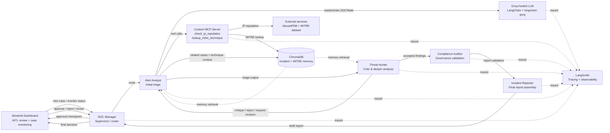
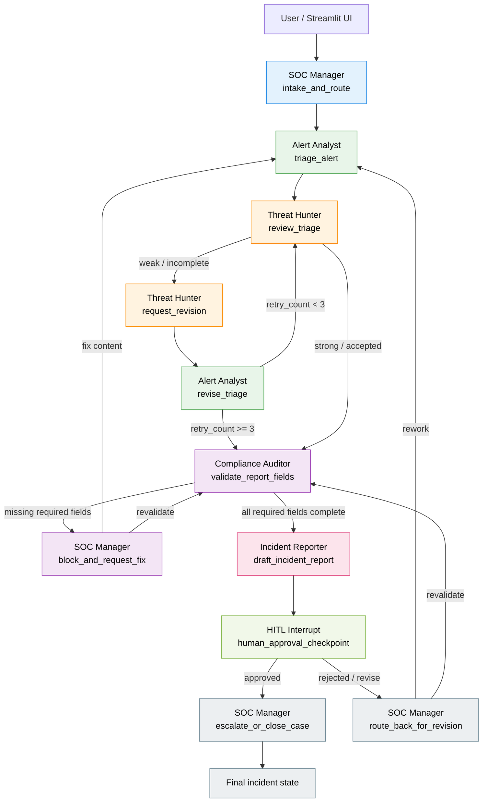

# SOC Agent Workforce — Implementation Plan

## 1) Proposed project structure

This plan assumes a Python stack with LangGraph, LangChain, Pydantic, ChromaDB, Streamlit, and a lightweight custom MCP server package. The proposal is intentionally modular so the orchestration graph, state model, tools, and UI can evolve independently.

```text
soc-agent-workforce/
├── README.md
├── PLAN.md
├── .env.example
├── requirements.txt
├── pyproject.toml
├── .gitignore
├── src/
│   └── soc_agent_workforce/
│       ├── __init__.py
│       ├── config.py
│       ├── logging_config.py
│       ├── constants.py
│       ├── models.py
│       ├── state.py
│       ├── utils/
│       │   ├── __init__.py
│       │   ├── datetime_utils.py
│       │   ├── validators.py
│       │   └── formatting.py
│       ├── mcp/
│       │   ├── __init__.py
│       │   ├── server.py
│       │   ├── tools.py
│       │   ├── abuseipdb_client.py
│       │   └── mitre_dataset.py
│       ├── memory/
│       │   ├── __init__.py
│       │   ├── chroma_client.py
│       │   ├── incident_memory.py
│       │   └── mitre_memory.py
│       ├── agents/
│       │   ├── __init__.py
│       │   ├── base_agent.py
│       │   ├── soc_manager.py
│       │   ├── alert_analyst.py
│       │   ├── threat_hunter.py
│       │   ├── compliance_auditor.py
│       │   └── incident_reporter.py
│       ├── graph/
│       │   ├── __init__.py
│       │   ├── workflow.py
│       │   ├── nodes.py
│       │   ├── conditions.py
│       │   ├── interrupts.py
│       │   └── routing.py
│       ├── governance/
│       │   ├── __init__.py
│       │   ├── report_validator.py
│       │   └── approval_policy.py
│       ├── observability/
│       │   ├── __init__.py
│       │   ├── agentops_setup.py
│       │   ├── tracing.py
│       │   └── langsmith_config.py
│       └── app/
│           ├── __init__.py
│           ├── streamlit_app.py
│           ├── components.py
│           └── session_state.py
├── data/
│   ├── mitre/
│   │   ├── attack_techniques.json
│   │   └── attack_groups.json
│   ├── sample_incidents/
│   │   └── demo_cases.json
│   └── seed/
│       └── default_rules.json
├── tests/
│   ├── unit/
│   │   ├── test_state.py
│   │   ├── test_tools.py
│   │   ├── test_validators.py
│   │   └── test_graph_flow.py
│   ├── integration/
│   │   ├── test_hil_approval.py
│   │   ├── test_self_healing.py
│   │   └── test_mcp_server.py
│   └── e2e/
│       └── test_streamlit_flow.py
├── docs/
│   ├── architecture.md
│   ├── mcp_tools.md
│   ├── runbook.md
│   └── incident_playbook.md
└── scripts/
    ├── bootstrap_chroma.py
    ├── load_mitre_data.py
    └── run_dev_server.py
```

### Design intent

- Python environment and dependency management will use uv exclusively: `uv init`, `uv add`, `uv sync`, and `uv run` are the required commands for this project.
- No `pip`, `venv`, `poetry`, or `conda` workflows should be used anywhere in setup or runtime commands.
- src/soc_agent_workforce/state.py defines the canonical SOCState object used by all nodes.
- src/soc_agent_workforce/graph/workflow.py owns the LangGraph orchestration flow.
- src/soc_agent_workforce/agents contains the five agent definitions.
- src/soc_agent_workforce/mcp contains the custom MCP server and tool implementations.
- src/soc_agent_workforce/memory contains ChromaDB integrations for incident and MITRE retrieval.
- src/soc_agent_workforce/app/streamlit_app.py provides interactive investigation triggering and monitoring.
- All LLM calls will use Groq via the `langchain-groq` integration or the Groq Python SDK with a `GROQ_API_KEY` environment variable.

### System architecture overview



This architecture keeps the workflow centered on a shared SOCState object while preserving a supervisor-led investigation pipeline, a review loop, and a human approval checkpoint before escalation or closure.

---

## 2) LangGraph data flow and orchestration diagram

The graph should be built around a supervisor-style design:

- SOC Manager acts as the orchestrator and decision-maker.
- Alert Analyst and Threat Hunter are primary investigation workers.
- Compliance Auditor performs validation and governance checks.
- Incident Reporter creates the final report package.
- A self-healing loop occurs between Alert Analyst and Threat Hunter.
- A HITL interrupt pauses before escalation/closure.

### Node-to-node flow (visual diagram)



### Execution semantics

- The SOC Manager starts every case and owns routing decisions between investigation, governance, and escalation.
- The alert triage step should produce a structured suspicion summary and initial factual evidence summary.
- The self-healing loop is internal to the investigation workflow and is not a permanent failure state; it is a governance mechanism to improve evidence quality.
- The HITL interrupt is intentionally placed before a closure or escalation action so a human analyst can confirm the final decision.
- LangGraph should expose a conditional edge such as:
  - triage_rejected -> revise triage
  - triage_accepted -> compliance_validation
  - missing_required_fields -> request_revision
  - complete_and_human_approved -> finalize

### Relevant state progression

The graph should mutate a single shared SOCState object throughout the pipeline. It should never create parallel, branch-local copies. All decisions should read from and update the same state record, with versioning or timestamp tracking for traceability.

---

## 3) SOCState Pydantic model: full schema and purpose

The shared state object is the backbone of this system. It should be a single Pydantic model with strongly typed fields, nested structures where useful, and explicit lifecycle values.

The following is the proposed schema contract. This is the design target before implementation; actual model names may be refined later but the semantics should remain stable.

### Proposed SOCState structure

- incident_id: str
  - Unique identifier of the investigation case.
  - Generated once at case creation.

- case_title: str | None
  - Human-readable title of the alert or incident.

- source: Literal["manual", "streamlit", "api", "ingest", "simulator"]
  - Where the case originated.

- severity: Literal["low", "medium", "high", "critical"] | None
  - Current severity assessment for triage and executive reporting.

- status: Literal["new", "triaged", "awaiting_human_approval", "reopened", "escalated", "closed", "needs_revision", "blocked"]
  - Lifecycle status of the case.

- created_at: datetime
  - Timestamp when case entered the system.

- updated_at: datetime
  - Last mutation timestamp.

- closed_at: datetime | None
  - Set when case is closed or escalated if applicable.

- investigation_priority: Literal["routine", "urgent", "critical"]
  - Operational priority assigned by manager or auto-routing rules.

- alert_summary: str | None
  - High-level description of the alert as provided by the input or first analyst pass.

- alert_source_system: str | None
  - SIEM, EDR, firewall, endpoint, cloud log source, etc.

- alert_id: str | None
  - Original alert identifier in the source tool or platform.

- raw_event_context: dict[str, Any] | None
  - Unprocessed source metadata from the original alert payload.

- ip_addresses: list[str]
  - Source, destination, and related IPs extracted from evidence.

- domains: list[str]
  - Domains associated with the alert or investigation.

- hashes: list[str]
  - File hashes or indicators related to malicious artifact analysis.

- user_accounts: list[str]
  - Affected or suspicious usernames or accounts.

- endpoint_names: list[str]
  - Endpoint or hostnames implicated in the incident.

- triage_notes: str | None
  - Narrative explanation written by Alert Analyst after initial review.

- triage_confidence: float | None
  - Confidence score from 0.0 to 1.0 for alert classification.

- triage_category: Literal["benign", "suspicious", "malicious", "unknown"] | None
  - High-level triage classification.

- triage_reasoning: list[str]
  - Bulletized reasoning items used by the analyst to justify classification.

- triage_evidence: list[str]
  - Evidence references such as IP reputation details, MITRE mapping, or log excerpts.

- triage_revisions: int
  - Number of times the triage has been revised by the worker after hunter critique.

- triage_revision_history: list[dict[str, Any]]
  - Chronological history of reviewer notes and updates.

- threat_hunt_summary: str | None
  - Result of Threat Hunter investigation and deeper analyst review.

- threat_hunt_findings: list[str]
  - Key findings related to tactics, techniques, or suspicious behaviors.

- mitre_techniques: list[str]
  - MITRE ATT&CK technique IDs or names mapped to the investigation.

- mitre_tactics: list[str]
  - MITRE ATT&CK tactics tied to the findings.

- suspicious_behavior_summary: str | None
  - Summary of attacker behavior or sequence of actions.

- entity_risk_score: float | None
  - Combined risk-ranking from agent analysis.

- risk_assessment: str | None
  - Narrative of why the incident is severe or low risk.

- compliance_status: Literal["pending", "passed", "failed", "blocked"]
  - Compliance Auditor status for the current report and process state.

- compliance_findings: list[str]
  - Missing fields, governance concerns, or policy non-conformances.

- required_fields_present: bool
  - Whether all mandatory fields are filled before the report can advance.

- required_fields_missing: list[str]
  - Names of missing field keys that block progression.

- incident_report: dict[str, Any] | None
  - The structured final incident report payload.

- report_ready_for_review: bool
  - Indicates whether the report has passed validation and is ready for HITL review.

- report_approval_status: Literal["pending", "approved", "rejected", "not_required"]
  - Human approval decision for escalation or closure.

- approval_reviewer: str | None
  - Human or operator who approved or rejected the report.

- approval_notes: str | None
  - Comments or rationale from the human reviewer.

- escalation_target: str | None
  - Team, queue, or org recipient for escalation.

- escalation_reason: str | None
  - The reason the incident is being escalated.

- final_decision: Literal["escalate", "close", "reopen", "request_revision", "hold"] | None
  - Final action chosen by the SOC Manager after approval or at manager discretion.

- human_in_the_loop_required: bool
  - Whether a human approval checkpoint is enforced before the incident can be closed or escalated.

- self_healing_retry_count: int
  - Counter for the alert-to-hunter feedback loop.

- self_healing_max_retries: int
  - The cap per policy; this should be set to 3.

- self_healing_status: Literal["inactive", "pending_review", "rejected", "accepted", "max_retries_reached"]
  - State of the self-healing review loop.

- reviewer_feedback: str | None
  - Comments from Threat Hunter critiquing the analyst output.

- final_summary: str | None
  - Final incident narrative for management or downstream stakeholders.

- evidence_links: list[str]
  - References to case artifacts, screenshots, log bundles, or case entries.

- related_incidents: list[str]
  - Incident IDs or case references with similar context or repeated patterns.

- memory_references: list[str]
  - ChromaDB collection IDs or retrieval references that support the case.

- created_by: str | None
  - Original user or trigger source for a manually created investigation.

- assigned_to: str | None
  - Current human or agent owner for the case.

- last_agent: str | None
  - Name of the most recent agent to update the state.

- agent_trace_ids: dict[str, str]
  - Map of agent name to LangSmith or tracing identifier.

- tool_trace_ids: dict[str, str]
  - Map of tool name to LangSmith trace IDs.

- notes: list[str]
  - Freeform narrative notes from all stages of the process.

- errors: list[str]
  - Process errors, validation failures, or tool exceptions encountered by the pipeline.

- metadata: dict[str, Any]
  - Additional structured metadata for future extension, including UI session references or custom fields.

### Model enforcement expectations

- The state must be mutated in place or by replacing the whole object in the graph state.
- Every important decision point should be captured in explicit booleans or status values.
- Required fields should be validated before the report can proceed to escalation or closure.
- The model should support both workflow state and human-runbook state, not just a report payload.

---

## 4) Agent responsibilities, inputs/outputs, and state interactions

The system uses five agents as defined in the project brief. Each agent should have a narrow, explicit role and “reads/writes” responsibilities over SOCState.

### 1. SOC Manager (supervisor)

Purpose:
- Orchestrates the workflow and decides when to route work between agents.
- Acts as the top-level supervisor and arbiter for escalation or closure decisions.

Inputs:
- New incident request from UI or API
- State from current workflow
- Human approval result or policy violations
- Summary output from Alert Analyst, Threat Hunter, Compliance Auditor, and Incident Reporter

Outputs:
- Routing directives to the next agent
- Escalation or closure decision
- Final status of the case after approval or request for revision

Reads from state:
- incident_id, status, severity, alert_summary, triage_confidence, compliance_status, report_ready_for_review, report_approval_status, final_decision

Writes to state:
- status, assigned_to, escalation_target, escalation_reason, final_decision, final_summary, last_agent, notes

### 2. Alert Analyst

Purpose:
- Performs initial triage and evidence collection.
- Determines whether the alert looks benign, suspicious, or malicious based on the information presented.

Inputs:
- Raw alert or case object from the UI or ingested data source
- Optional context from ChromaDB for prior related incidents
- Derived IP/domain/artifact data from custom tools

Outputs:
- Triage classification
- Initial evidence summary and reasoning
- Candidate MITRE technique and risk indicators

Reads from state:
- alert_summary, raw_event_context, ip_addresses, domains, hashes, alert_id, source, severity

Writes to state:
- triage_notes, triage_confidence, triage_category, triage_reasoning, triage_evidence, triage_revisions, risk_assessment, mitre_techniques, status, last_agent

### 3. Threat Hunter

Purpose:
- Reviews the analyst’s triage quality and completeness.
- Runs deeper hunting logic, context enrichment, pattern matching, and critique.
- Implements the self-healing loop by sending weak triage back for revision.

Inputs:
- Alert Analyst output and evidence
- Prior incident memory from ChromaDB
- MITRE technique context and threat intel sources

Outputs:
- Review verdict: accepted or rejected
- Additional hunting findings
- Request for triage revision with explicit critique

Reads from state:
- triage_notes, triage_confidence, triage_reasoning, triage_evidence, threat_hunt_summary, mitre_techniques, suspicious_behavior_summary, self_healing_retry_count

Writes to state:
- threat_hunt_summary, threat_hunt_findings, reviewer_feedback, self_healing_status, self_healing_retry_count, mitre_tactics, final_summary, last_agent

### 4. Compliance Auditor

Purpose:
- Validates the generated incident report before it can move forward.
- Enforces required fields and governance checks.
- Ensures policy and record completeness before escalation or closure.

Inputs:
- Draft incident report payload
- Current investigation state and evidence completeness
- Policy definitions or required-field list

Outputs:
- Pass/fail validation result
- Missing required field list
- Compliance findings or remediation instructions

Reads from state:
- incident_report, report_ready_for_review, required_fields_present, required_fields_missing, compliance_status, severity, final_summary, evidence_links

Writes to state:
- compliance_status, compliance_findings, required_fields_present, required_fields_missing, report_ready_for_review, status, last_agent

### 5. Incident Reporter

Purpose:
- Builds the final incident narrative, executive summary, and final report package.
- Formats the case in a way that is reviewable by a human analyst and ready for escalation/closure.

Inputs:
- Approved triage and hunter findings
- Validated evidence and compliance metadata
- Final case status after governance checks

Outputs:
- Structured incident report object
- Summary for human review and escalation package

Reads from state:
- triage_notes, threat_hunt_summary, mitre_techniques, severity, final_summary, evidence_links, risk_assessment, compliance_status

Writes to state:
- incident_report, report_ready_for_review, final_summary, escalation_target, escalation_reason, last_agent, notes

---

## 5) MCP server tools: custom tools, inputs/outputs, and dependencies

The project requires a custom MCP server with at least two tools. The plan includes two core tools and leaves room for more later.

### Tool 1: check_ip_reputation

Purpose:
- Query an external IP reputation service to enrich a suspicious IP or set of IPs.
- Determine if an IP is malicious, suspicious, or part of a known bad actor list.

External dependency:
- AbuseIPDB API
- Requires an AbuseIPDB API key

Inputs:
- ip_address: str
- categories: list[int] | None
- max_age_in_days: int | None
- verbose: bool | None

Outputs:
- AbuseIPDB score
- Number of reports
- Categories and confidence details
- ISP / domain / country metadata if available
- Verdict summary such as malicious, suspicious, or clean

State usage:
- Reads from state.ip_addresses
- Writes to state.triage_evidence, triage_reasoning, risk_assessment, or notes

Suggested tool contract:
- Input: {"ip_address": "8.8.8.8"}
- Output: {"ip": "8.8.8.8", "is_public": true, "abuse_confidence_score": 80, "total_reports": 44, "categories": [18, 21], "country_code": "US", "verdict": "suspicious"}

### Tool 2: lookup_mitre_technique

Purpose:
- Query a local MITRE ATT&CK dataset for technique details and context by ID or keyword.
- Associate suspicious behavior with known adversary techniques.

External dependency:
- Local JSON or SQLite dataset derived from MITRE ATT&CK content
- No external API required for normal operation

Inputs:
- technique_id: str | None
- technique_name: str | None
- tactic: str | None
- keyword: str | None

Outputs:
- Technique ID and name
- Tactics
- Description and detection guidance
- Permutation of relevant data with a confidence-backed matching summary

State usage:
- Reads from state.threat_hunt_findings or triage reasoning
- Writes to state.mitre_techniques, mitre_tactics, threat_hunt_summary, suspicious_behavior_summary

Suggested tool contract:
- Input: {"technique_id": "T1059.001"}
- Output: {"id": "T1059.001", "name": "PowerShell", "tactic": "Execution", "description": "PowerShell command-line ..."}

### Additional future optional tools

- lookup_domain_reputation
- check_url_safety
- get_related_incidents_by_behavior
- enrich_entity_by_osint

These are optional and should be added only after the core workflow is stable.

---

## 6) ChromaDB storage and retrieval model

This project requires vector memory for past incidents and for MITRE technique context. ChromaDB should be used as the memory layer, with at least two collections.

### Collection 1: incidents

Purpose:
- Store historical incident summaries and relevant evidence for future similarity matching.

Stored records:
- incident_id
- incident_title
- summary
- severity
- triage classification
- observed indicators (IP, domains, hashes, behaviors)
- MITRE techniques
- final resolution / escalation path
- timestamp
- embeddings from a semantic text description

Example content:
- A summary string combining attack narrative + key malicious indicators.
- The document should be sentence-rich enough to make nearest-neighbor retrieval useful.

Retrieval pattern:
- Query by text from current incident or summary
- Search for similar prior incidents based on attack narrative, TTPs, domain behavior, or malicious IP patterns
- Use top-k retrieval to bring relevant past cases into the current decision process

### Collection 2: mitre_techniques

Purpose:
- Cache MITRE ATT&CK technique descriptions and detection guidance for quick lookups.

Stored records:
- technique_id
- name
- tactic
- platform
- description
- detection guidance
- related data sources
- embeddings created from the technique description and detection narrative

Retrieval pattern:
- Query by technique ID, tactic, or behavior keywords
- Use similarity lookup by “PowerShell execution”, “credential dumping”, “lateral movement”, etc.
- Use this in Threat Hunter and Alert Analyst context enrichment

### Retrieval strategy

Use a consistent retrieval workflow:

1. Current state summary is converted into a text chunk (e.g., alert_summary + suspicious_behavior_summary + top evidence).
2. Query ChromaDB for nearest matches.
3. Attach the top results to the case context.
4. Persist the retrieved memory IDs into state.memory_references.
5. Record whether the memory was used for triage enrichment, MITRE correlation, or historical pattern matching.

### Memory governance

- Only relevant incident records should be retrieved, not raw full telemetry.
- ChromaDB data should be sanitized to avoid storing secrets or raw credentials.
- A retention policy can be defined later but is not required for MVP.

---

## 7) Required environment variables / API keys and where to get free ones

The system requires a small set of environment variables. A .env.example file should define all required values with placeholders.

### Required environment variables

- GROQ_API_KEY
  - Required for all agent and LLM calls through Groq.
  - Create a free account at Groq Cloud and generate an API key from the dashboard.

- GROQ_MODEL
  - The Groq-hosted model used by the agent pipeline, such as `llama-3.1-70b-versatile` or another approved Groq model.
  - This should be configured in the environment or app config.

- LANGSMITH_API_KEY
  - Required for LangSmith tracing and observability.
  - Get a free account at LangSmith and create a project/API key.

- LANGSMITH_PROJECT
  - Name of the project used for tracing this workforce.
  - Set in the LangSmith dashboard or environment.

- LANGSMITH_TRACING
  - Usually set to "true" to enable tracing.

- ABUSEIPDB_API_KEY
  - Used by the custom check_ip_reputation tool.
  - Sign up for a free AbuseIPDB account and request an API key.

- CHROMA_HOST
  - Default host for the ChromaDB service.
  - If running locally, this can be "localhost".

- CHROMA_PORT
  - Port for ChromaDB service.
  - Usually 8000 or default local port depending on deployment.

- CHROMA_COLLECTION_INCIDENTS
  - Name of the incidents collection.

- CHROMA_COLLECTION_MITRE
  - Name of the MITRE dataset collection.

- APP_ENV
  - Runtime environment, e.g. "dev", "staging", or "prod".

- SECRET_KEY or APP_SECRET
  - Optional, used for UI session integrity or simple secure internal processes.

- STREAMLIT_SERVER_PORT
  - For local Streamlit app port.

- STREAMLIT_THEME
  - Optional if custom theming is desired.

### Optional later variables

- GOOGLE_API_KEY
- ANTHROPIC_API_KEY
- AWS_ACCESS_KEY_ID / AWS_SECRET_ACCESS_KEY
- LOG_LEVEL
- MISTRAL_API_KEY

### Recommendation

- Keep all runtime secrets in a local .env file.
- Add .env to .gitignore.
- Use .env.example as the template for onboarding and setup.

---

## 8) Ordered implementation sequence

The build sequence should follow a deterministic order so the system is stable before the more complex orchestration and observability mechanics are added. This is the recommended sequence.

### Step 1: Initialize the project with uv and define the state model

Why first:
- The graph, tool calls, and all agent outputs depend on a consistent state contract.
- Using uv from the start ensures the environment remains reproducible and matches the project requirement.
- If the state model is unstable, all later steps will be fragile.

Deliverables:
- `uv init` project skeleton
- `pyproject.toml` dependency specification
- `uv.lock` generated by `uv sync`
- SOCState model
- Field validation rules
- Required-field governance rules

### Step 2: Build the local data and memory layer

Why second:
- Both analyst triage and hunter context rely on local MITRE data and historical incident memory.
- ChromaDB and dataset loading should be working before orchestration is built.

Deliverables:
- MITRE ATT&CK dataset import
- ChromaDB collections
- Retrieval functions for similar incidents and MITRE techniques

### Step 3: Implement the custom MCP tools

Why third:
- The tool layer is a dependency for the analysts and hunter workflow.
- It is easier to test and debug once the state and memory layer is available.

Deliverables:
- MCP server
- check_ip_reputation
- lookup_mitre_technique
- basic tool error handling

### Step 4: Create the agent skeletons and LangGraph nodes

Why fourth:
- Agents need a stable state contract and tool access before they can be wired into the graph.
- The graph should be built with clear nodes and conditions.

Deliverables:
- Base agent abstraction
- Node definitions for each agent
- Manager routing logic

### Step 5: Add the self-healing loop

Why fifth:
- Once the triage node is functional, add the triage critique and revision cycle.
- This is a critical quality gate, but it should be introduced only after the core agent flow is stable.

Deliverables:
- Threat Hunter review
- revision callback to Alert Analyst
- retry cap of 3
- explicit acceptance or rejection state update

### Step 6: Add compliance validation and required-field gating

Why sixth:
- Governance checks should happen after the incident has been investigated but before escalation or closure.
- This ensures the graph does not finalize incomplete reports.

Deliverables:
- Required-field list
- Validation node
- Blocked / failed / passed statuses

### Step 7: Implement HITL approval interrupt

Why seventh:
- This adds the human decision gate before closure or escalation.
- It is operationally important but should be introduced after the logic is otherwise stable.

Deliverables:
- approval interrupt in the graph
- human review step
- reopen/revise/approve decision branches

### Step 8: Add AgentOps / LangSmith observability

Why eighth:
- Observability should be layered in at the end of the main logic so all agents and tool calls are traced without over-instrumenting early prototypes.

Deliverables:
- LangSmith tracing configuration
- Agent-level tracing
- Tool-level trace IDs and logs

### Step 9: Build the Streamlit app and UI workflow

Why ninth:
- The UI benefits from the underlying graph being already stable.
- UI work is easiest after the orchestration and state model is defined.

Deliverables:
- Input form for alerts
- Case dashboard
- Agent activity stream
- Human approval interface

### Step 10: Integration testing and tuning

Why last:
- Once all critical components exist, run end-to-end tests for self-healing, validation, approval, and app flow.

Deliverables:
- tests for graph behavior
- validation of environment setup
- regression tests for tool usage and state mutation

---

## 9) Open questions and assumptions to confirm before coding

These are the items that should be confirmed before implementation begins.

1. Model provider requirement
   - The project will use Groq as the required LLM provider for all agent and tool-backed LLM calls.
   - Confirm the exact Groq model family and context window you want for the capstone, such as `llama-3.1-70b-versatile` or another supported Groq-hosted model.

2. Local infrastructure preference
   - Should ChromaDB run as a local service, via Docker, or in-memory during the MVP?
   - For a capstone, local containerized ChromaDB is a good default, but this should be confirmed.

3. Data source for case ingestion
   - Will the app start with manual input only, or should it support a mock SIEM/EDR feed as the first integration path?

4. Human approval mechanism
   - Do you want the approval to be a hard interrupt that requires the Streamlit app to pause and wait for a human, or a less intrusive policy-based approval step?

5. Governance standard for required fields
   - Which fields are absolutely mandatory before a report can proceed?
   - For example: alert_id, severity, triage_summary, MITRE mapping, evidence list, final decision, or approval results.

6. Report format
   - Should the incident report be JSON-only, plain text, or a hybrid structured summary with a narrative section?

7. MCP server hosting mode
   - Should the custom MCP server run as a standalone process, as part of the app, or embedded in the local workflow environment?

8. Security posture for demos
   - Should sensitive or realistic log data be scrubbed or anonymized in the sample runs and demonstrations?

9. Streamlit dashboard scope
   - Is the web app meant to be a minimal demo dashboard or a more complete SOC portal with live logs, investigation timeline, and approval controls?

10. Escalation model
   - Should escalation simply set a case as escalated, or should it also route to a specific team or queue in the app?

---

## Summary

This plan centers on a stable, shared SOCState-driven LangGraph workflow with five specialized agents, a custom MCP server, memory-backed enrichment, governance validation, human approval gates, and a UI for operational oversight. The design intentionally separates concerns so the system is easy to build incrementally and test at each checkpoint.

Important implementation constraints for this project are now fixed:
- Use uv for all Python environment setup and dependency management (`uv init`, `uv add`, `uv sync`, `uv run`).
- Do not use `pip`, `venv`, `poetry`, or `conda` for this project.
- Use Groq as the LLM provider for all agent- and model-driven calls using `GROQ_API_KEY` and the `langchain-groq` integration or Groq SDK.

The next step is to review this plan and confirm the assumptions above. Once approved, the project can begin implementation in the exact order laid out here to reduce risk and prevent architecture churn.
