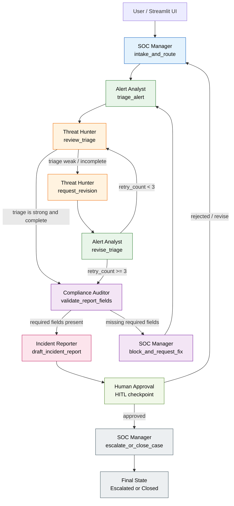

# SOC Agent Workforce Architecture

This workflow follows the supervisor pattern: the SOC Manager routes the investigation, the Alert Analyst performs initial triage, the Threat Hunter critiques and repairs weak analysis, the Compliance Auditor validates required fields, the Incident Reporter drafts the final report, and a human reviewer approves escalation or closure before the case is finalized.
